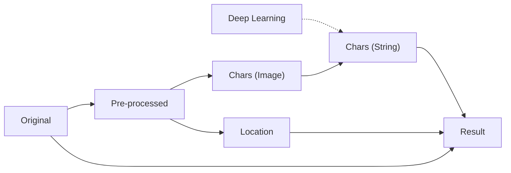

# opencv-ocr

Implement OCR based on OpenCV ([opencv-python](https://pypi.org/project/opencv-python)).

## General idea

To implement OCR with OpenCV, we will follow these general steps:

1. **Preprocess the image**: OCR requires a clear, bright, and noise-free image, so the first step is to preprocess the image, such as removing noise, smoothing, enhancing contrast, binarizing, and so on.
2. **Text localization**: OCR needs to recognize the text, which must be localized first. We can use [edge detection algorithms](https://docs.opencv.org/3.4/da/d22/tutorial_py_canny.html) and [morphological operations](https://docs.opencv.org/4.x/d9/d61/tutorial_py_morphological_ops.html) provided by OpenCV, such as erosion and dilation, to detect and segment text regions.
3. **Character segmentation**: Our OCR task is to recognize individual characters rather than whole words, so that we need to use character segmentation algorithms to further segment the text regions into individual characters.
4. **Feature extraction**: Once our text regions or characters are segmented, we need to extract their features for recognition. we can use [feature extraction algorithms](https://docs.opencv.org/3.4/db/d27/tutorial_py_table_of_contents_feature2d.html) provided by OpenCV, such as [SIFT](https://docs.opencv.org/3.4/da/df5/tutorial_py_sift_intro.html), [SURF](https://docs.opencv.org/3.4/df/dd2/tutorial_py_surf_intro.html), or [ORB](https://docs.opencv.org/3.4/d1/d89/tutorial_py_orb.html), etc.
5. **Train the model**: Once we have prepared the feature data, we can start training the model. We can use various machine learning algorithms, such as [Support Vector Machine (SVM)](https://docs.opencv.org/3.4/d1/d73/tutorial_introduction_to_svm.html), [Neural Networks](https://docs.opencv.org/4.x/d2/d58/tutorial_table_of_content_dnn.html), [Random Forest](https://docs.opencv.org/3.4/d0/d65/classcv_1_1ml_1_1RTrees.html), etc.
6. **Recognize text**: When our model is trained, we can use it to recognize text. We can use the model to predict the text in the image and return the results to the user.

Flowchart:

## License

The code in this project is released under the [MIT License](./LICENSE).
