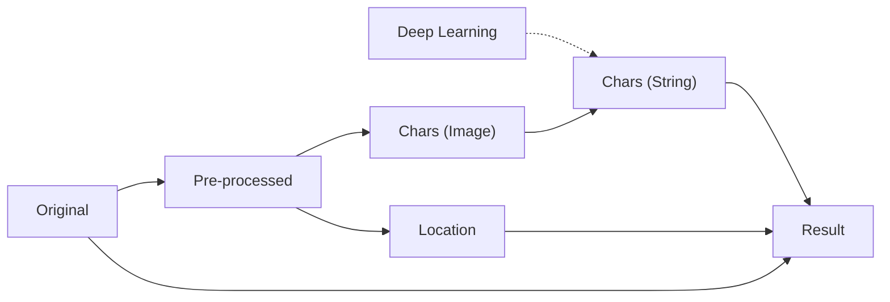

# opencv-ocr

<p align="center">
  
</p>

Implement OCR based on OpenCV ([opencv-python](https://pypi.org/project/opencv-python)).

## General idea

To implement OCR with OpenCV, we will follow these general steps:

1. **Preprocess the image**: OCR requires a clear, bright, and noise-free image, so the first step is to preprocess the image, such as removing noise, smoothing, enhancing contrast, binarizing, and so on.
2. **Text localization**: OCR needs to recognize the text, which must be localized first. We can use [edge detection algorithms](https://docs.opencv.org/3.4/da/d22/tutorial_py_canny.html) and [morphological operations](https://docs.opencv.org/4.x/d9/d61/tutorial_py_morphological_ops.html) provided by OpenCV, such as erosion and dilation, to detect and segment text regions.
3. **Character segmentation**: Our OCR task is to recognize individual characters rather than whole words, so that we need to use character segmentation algorithms to further segment the text regions into individual characters.
4. **Feature extraction**: Once our text regions or characters are segmented, we need to extract their features for recognition. we can use [feature extraction algorithms](https://docs.opencv.org/3.4/db/d27/tutorial_py_table_of_contents_feature2d.html) provided by OpenCV, such as [SIFT](https://docs.opencv.org/3.4/da/df5/tutorial_py_sift_intro.html), [SURF](https://docs.opencv.org/3.4/df/dd2/tutorial_py_surf_intro.html), or [ORB](https://docs.opencv.org/3.4/d1/d89/tutorial_py_orb.html), etc.
5. **Train the model**: Once we have prepared the feature data, we can start training the model. We can use various machine learning algorithms, such as [Support Vector Machine (SVM)](https://docs.opencv.org/3.4/d1/d73/tutorial_introduction_to_svm.html), [Neural Networks](https://docs.opencv.org/4.x/d2/d58/tutorial_table_of_content_dnn.html), [Random Forest](https://docs.opencv.org/3.4/d0/d65/classcv_1_1ml_1_1RTrees.html), etc.
6. **Recognize text**: When our model is trained, we can use it to recognize text. We can use the model to predict the text in the image and return the results to the user.

Flowchart:



## Implementation principle

Next, I will explain the specific steps for us to implement this OCR program with examples.

Before we start, this is the example picture we used:

<p align="center">
  
</p>

### Preprocess the image

Image preprocessing is a key step to achieve an efficient and accurate OCR program. This step is mainly to enhance image **quality** and **optimize the next steps**.

We use operations such as **denoising**, **smoothing**, **enhanced** **contrast** and binaryization to better identify text. Clear, bright and noise-free images help to improve the accuracy of the OCR system. In addition, image preprocessing can also adapt the OCR program to different types of images. In real life, the image may be affected by lighting, camera quality, angle and other factors, resulting in poor image quality. Preprocessing helps to solve these problems, so that the OCR program can work normally under different conditions. **The pre-processed image has better quality and clarity, which helps to improve the effect of next steps, such as text positioning, character segmentation, feature extraction, etc.**

```python
def preprocess_image(img, ksize=3):
    # Grayscale
    img = cv.cvtColor(img, cv.COLOR_BGR2GRAY)

    # Denoising
    img = cv.medianBlur(img, ksize=ksize)

    # Binaryization
    _, img_bin = cv.threshold(
        img, 0, 255, cv.THRESH_BINARY + cv.THRESH_OTSU)

    # Inverse the binary image
    img_bin = 255 - img_bin

    return img_bin
```

<p align="center">
  
</p>

### Character segmentation

然后我们需要将图像中的文本区域分割成单个字符。相比于完整的句子或者单词，识别单个字母更不容易发生歧义（因为总共只有 26 种可能性），从而提高整体的识别精度。并且将句子分割成单个字母后，可以将问题简化为分类问题，为每个字母建立一个分类器。这样，训练模型的难度降低，同时也降低了计算成本。

最后，分割成单个字母后，OCR 系统可以更容易地支持多种语言，因为大多数语言都是由基本字符组成的（我们的 OCR 软件暂时不支持多语言）。

我们使用投影的方法确每个字符的位置，然后根据位置对其进行切割；同时，记录每个字符的位置，以备后续使用。

我们首先计算水平投影，并通过它对图片进行横向切割：

```python
def get_h_progection(img):
    r, c = img.shape
    h_progection = np.zeros(img.shape, np.uint8)
    hrowsum = [0]*r
    for i, j in product(range(r), range(c)):
        if img[i, j] == 255:
            hrowsum[i] += 1
    for i in range(r):
        for j in range(hrowsum[i]):
            h_progection[i, j] = 255
    cv.show('h_progection', h_progection)
    return hrowsum
```

<p align="center">
  
</p>

<p align="center">
  
</p>

然后我们计算垂直投影，并通过它对图片进行纵向切割 (别忘了为每个字符加上边框，以便深度学习模型识别)：

```python
def get_v_progection(img):
    r, c = img.shape
    v_progection = np.zeros(img.shape, np.uint8)
    vcolsum = [0]*c
    for i, j in product(range(r), range(c)):
        if img[i, j] == 255:
            vcolsum[j] += 1
    for j in range(c):
        for i in range(r-vcolsum[j], r):
            v_progection[i, j] = 255
    cv.imshow('v_progection', v_progection)
    return vcolsum
```

<p align="center">
  
</p>

<p align="center">
  
</p>

### Recognize text

为了节约时间，我们跳过了训练深度学习模型的步骤，直接使用了 Google 的 Tesseract 团队开源的模型。

直接调用 Tesseract 的 API 对字符图片进行识别：

```python
def recognize_text(char):
    return pytesseract.image_to_string(char, lang='eng', config='--psm 10').strip()
```

### Synthesis results

最后，将字符的位置信息（绿色方框），以及识别结果（红色字符）绘制到原图上：

```python
str = []
font_size, font_weight = 1, 2
for i in range(len(rows)):
    for j in range(len(rows[i])):
        text = recognize_text(rows[i][j])
        cv.rectangle(img, (p[i][j][1]-p[i][j][3], p[i][j]
                           [0]-p[i][j][2]), (p[i][j][1], p[i][j][0]), (0, 255, 0), 2)
        cv.putText(img, text, (p[i][j][1]-p[i][j][3]-4, p[i][j][0]-p[i]
                   [j][2]-1), cv.FONT_HERSHEY_COMPLEX, font_size, (50, 50, 255), font_weight)
        str.append(text)

print(''.join(str), end=None)
cv.imshow('Result', img)
cv.waitKey(0)
```

<p align="center">
  
</p>

## License

The code in this project is released under the [MIT License](./LICENSE).
